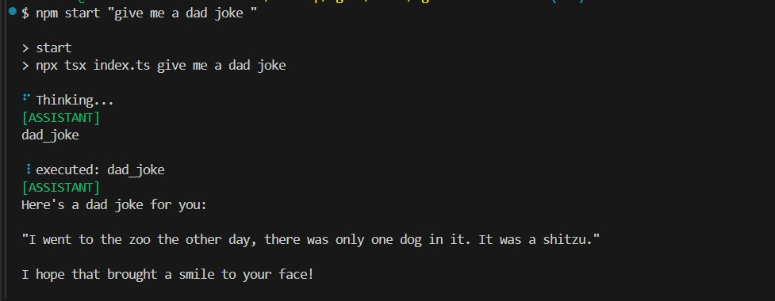
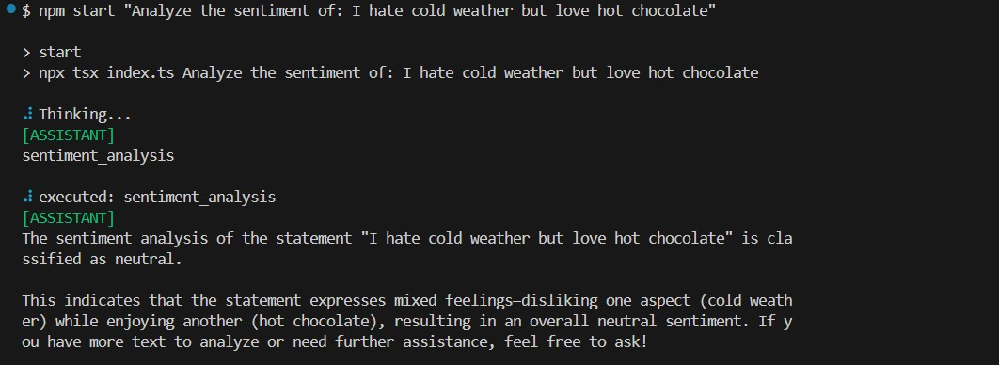
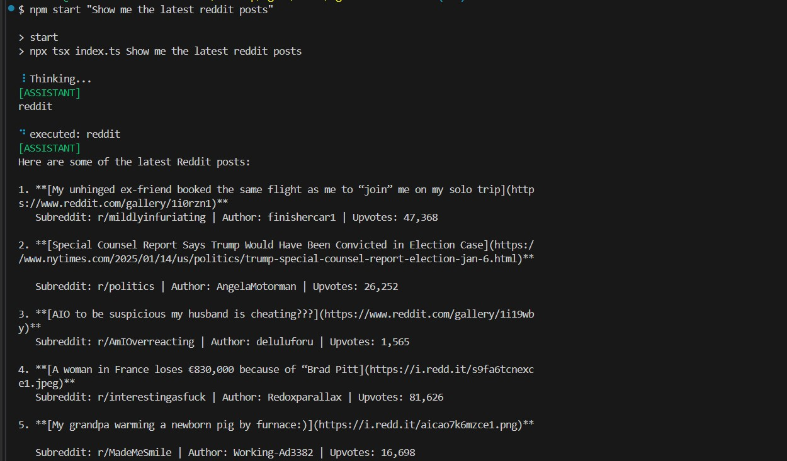
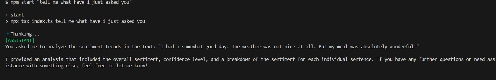
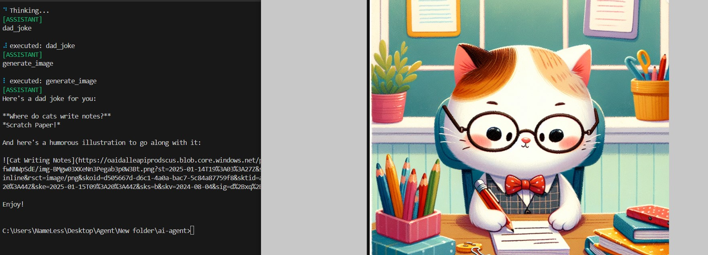
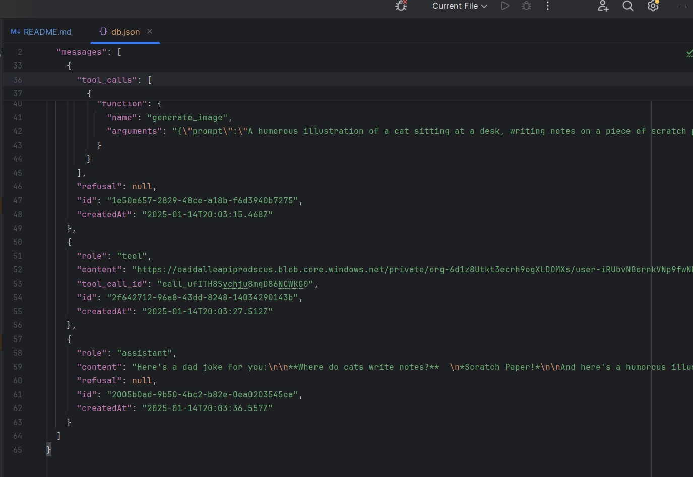

# Chat-Based AI Agent

A simple yet versatile **chat-based AI assistant** built with Node.js. It uses **OpenAI** under the hood and **remembers interactions** via a local `db.json` database. This agent can perform various tasks, including generating dad jokes (optionally with images), fetching Reddit front-page posts, generating quotes, and performing sentiment analysis (both simple and advanced *trends* analysis).

## Table of Contents
- [Overview](#overview)
- [Features](#features)
- [Project Structure](#project-structure)
- [Installation](#installation)
- [Usage](#usage)
- [Memory and Persistence](#memory-and-persistence)
- [Screenshots](#screenshots)
- [Future Plans](#future-plans)

---

## Overview
This AI agent processes your prompts in a **conversational manner**, storing the conversation history in `db.json`. It can:
1. Respond directly if it knows an answer.
2. If needed, call **tools** (like *Reddit*, *Dad Joke*, *Image Generation*, *Sentiment Analysis*, etc.) to get the job done.
3. Provide results and maintain context across multiple turns.

All interactions and tool results are recorded so that the agent *remembers* what was discussed.

---

## Features
1. **Dad Jokes**  
   - *“Give me a dad joke”*  
   - Optionally generate a themed AI image alongside the joke.
   
2. **Reddit Integration**  
   - *“Fetch the latest posts from Reddit”*  
   - Returns JSON-formatted Reddit front-page posts.

3. **Quote Generation**  
   - *“Give me an inspiring quote”*  
   - Provides random quotes to motivate or inspire.

4. **Image Generation**  
   - *“Generate an image with DALL-E style prompt: A happy cat on Mars.”*  
   - Returns a URL to the generated image.

5. **Basic Sentiment Analysis**  
   - *“What is the sentiment of this sentence?”*  
   - Returns *positive*, *negative*, or *neutral*.

6. **Advanced Sentiment Trends**  
   - Analyzes large text **sentence by sentence**, calculating sentiment changes and a confidence score.  
   - *“Analyze sentiment trends in this text: I love coding. However, debugging is bad...”*

7. **Local Memory**  
   - Stores conversation logs in `db.json` so the agent *remembers* previous user interactions.

---

- **`index.ts`** loads your prompt from CLI arguments and runs the agent.
- **`agent.ts`** handles the loop to call the LLM, check for tool usage, and return output.
- **`memory.ts`** is where interactions are read/written to `db.json`.
- **`toolRunner.ts`** orchestrates how each tool is called and returns results.
- **`index.ts`** loads your prompt from CLI arguments and runs the agent.
- **`agent.ts`** handles the loop to call the LLM, check for tool usage, and return output.
- **`memory.ts`** is where interactions are read/written to `db.json`.
- **`toolRunner.ts`** orchestrates how each tool is called and returns results.

---

## Installation
1. **Clone this repo** (or create a new project).  
2. **Install dependencies**:  
```bash
   npm install
   
``` 
```bash
   npm install openai
   
``` 
3. **Set up your .env if needed (for OpenAI API keys).**

## Usage
Usage
Run the agent with a command-line prompt:

```bash
Copy code
npm start "Give me a dad joke"
```
Examples:
- Dad Joke
```bash
npm start "Give me a dad joke"
```
- Dad Joke with an Image
```bash
npm start "Give me a dad joke with an image"
```
- Reddit
```bash
npm start "Fetch the latest reddit posts"
```
- Quote
```bash
npm start "Give me a quote"
```
-Basic Sentiment
```bash
npm start "What's the sentiment of this sentence: 'I love coding!'" 
```
- Sentiment Trends
```bash
npm start "Analyze sentiment trends in this text: I had a somewhat good day. The weather was not nice at all. But my meal was absolutely wonderful!"
```
**The agent will respond in the terminal, sometimes showing which tool it’s using.**

## Memory and Persistence
All user messages, assistant responses, and tool outputs are stored in db.json. This allows the AI to keep track of:
- Past user requests
- Tool calls and responses
- Ongoing context of the conversation
Feel free to inspect db.json to see the conversation history. If you need a fresh start, you can clear or delete db.json (but you’ll lose all previous logs).


## Screenshots
Below are some example screenshots (not included directly in the repository, but referenced here):

- Dad Jokes 
**Showcasing how the agent fetches a dad joke and returns it in the terminal.**

- Sentiment Analysis 
**Demonstrating simple sentiment or advanced sentiment trend analysis.**

- Reddit 
**Showing how the agent fetches and displays the latest front-page posts in JSON format.**

- Chat-based Memory 
**Illustrating how the agent remembers your conversation history.**

- Image Generation


- db.json 
**Highlight how interactions are stored.**


## Future Plans
- **Extend the Tools: Add more local functionalities (e.g., unit converter, local dictionary, etc.).**
- **Improved Summaries: Use advanced local summarization or text-rank methods for summarizing large documents.**
- **Enhanced Memory: Possibly integrate vector databases or embeddings for more intelligent recall.**
- **UI/Chat Interface: Provide a web or desktop GUI for a more user-friendly chat experience.**
